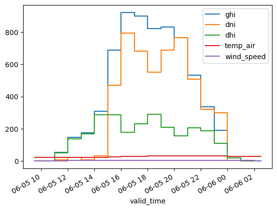

# energy-forecasting-tools

This repository is a place for some energy forecasting tools. It currently just includes solar-related tools, but may expand to include wind and (maybe one day) electric load.

Look at the notebook [solar_example.ipynb](solar_example.ipynb) for some examples, and [more_solar_examples.ipynb](more_solar_examples.ipynb) for more examples. Both of these convert the resource forecasts to power.

There is also a basic solar ensemble forecast demonstrated in [ensemble_example.ipynb](ensemble_example.ipynb).

Solar forecasts can be created using the NOAA GFS, NOAA HRRR, and ECMWF IFS (open data version) models. 

## Quick example

Here's a quick example of just getting a resource data forecast:

```python
from forecast_solar import get_solar_forecast

latitude = 33.5
longitude = -86.8
init_date = '2024-06-05 6:00' # datetime the forecast model was initialized
resource_data = get_solar_forecast(
    latitude,
    longitude,
    init_date,
    length_hours=18, # 18 hours are included in the forecast
    lead_time_hours=3, # forecast starts 3 hours out from the init_date
    model='hrrr', # use NOAA HRRR
)
resource_data[
    ['ghi','dni','dhi','temp_air','wind_speed']
              ].plot(drawstyle='steps-mid')
```

with this output:



## Suggested environment setup:
Using miniforge:
```
conda create --name energy_forecasting_env python=3.12 -y
conda activate energy_forecasting_env
conda install -c conda-forge herbie-data -y
pip install pvlib ipykernel
```

Then get a copy of `pv_model.py` from https://github.com/williamhobbs/pv-system-model and place it in the same folder as scripts you want to run. 

## References
This project uses several Python packages, including pvlib, an open-source solar PV modeling package [1, 2], and Herbie [3, 4], a package for accessing weather forecast data from NOAA. `pv_model.py` (with the `model_pv_power()` function used here) comes from [5] which leverages some functions from [6].


[1] Anderson, K., Hansen, C., Holmgren, W., Jensen, A., Mikofski, M., and Driesse, A. “pvlib python: 2023 project update.” Journal of Open Source Software, 8(92), 5994, (2023). [DOI: 10.21105/joss.05994](http://dx.doi.org/10.21105/joss.05994).

[2] https://github.com/pvlib/pvlib-python

[3] Blaylock, B. K. (2025). Herbie: Retrieve Numerical Weather Prediction Model Data (Version 2025.3.1) [Computer software]. https://doi.org/10.5281/zenodo.4567540

[4] https://github.com/blaylockbk/Herbie

[5] https://github.com/williamhobbs/pv-system-model

[6] Hobbs, W., Anderson, K., Mikofski, M., and Ghiz, M. "An approach to modeling linear and non-linear self-shading losses with pvlib." 2024 PV Performance Modeling Collaborative (PVPMC). https://github.com/williamhobbs/2024_pvpmc_self_shade 
